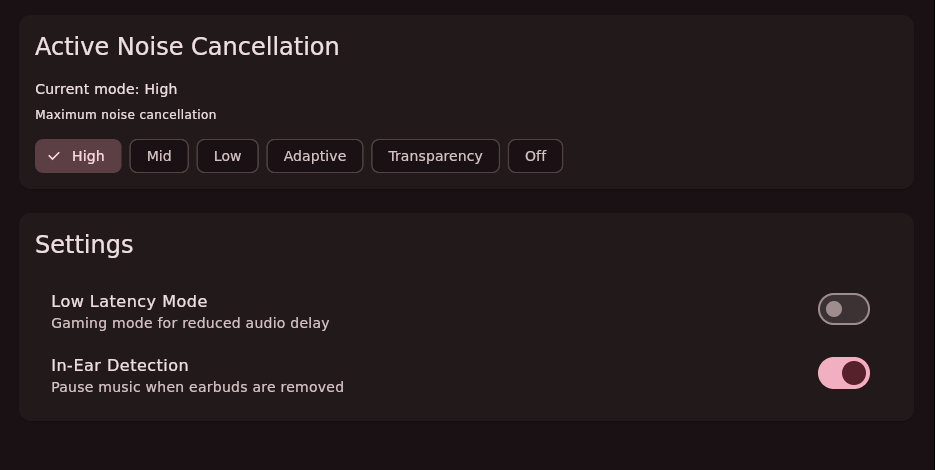
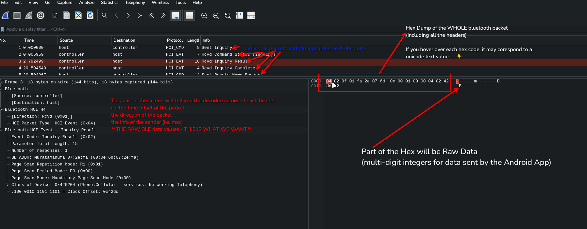

# CMF*nix

## Screenshot Previews

## Process of getting BL Values

1. On a spare **Android** Phone, [turn on developer mode](https://developer.android.com/studio/debug/dev-options), enable bluetooth HCI snoop logs & "USB Debugging" (remember to toggle all of these off after)
2. Go into CMF Nothing Android App, connect your buds, toggle all of the functions (i.e. low latency mode, etc.)
3. Install [ADB](https://developer.android.com/tools/adb) via your package manager, connect your Android Phone to your desktop device via USB, run `adb usb` && `adb devices` you should see your Android Device Listed, if not, check your connection
4. run `adb bugreport` & unzip the archive, navigate to `./FS/data/log/bt/btsnoop_hci.log`, load this file into the Wireshark packet sniffing application on your Desktop, it should look something like [**this**](https://github.com/0dayminusone/CMF-Linux-Client/blob/master/media/wireshark.png):

## How to Build

- `flutter pub get`
- `flutter build -d [your target]` target = linux (the infa is in place to make proj OS agnostic)
